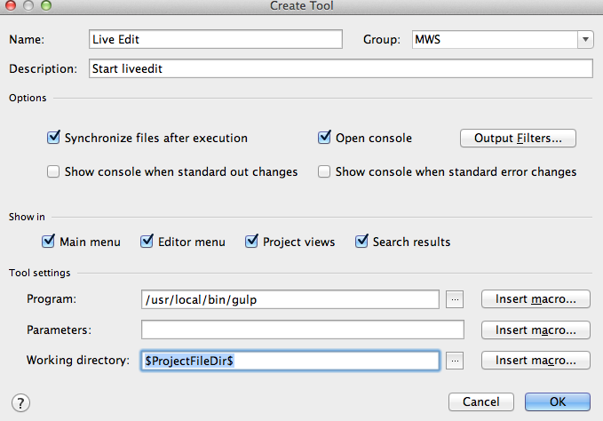

# Modern Website Seed (MWS)

A reference project which demonstrates a development workflow for building web applications using AngularJS, Bootstrap3, Gulp, Jasmine, JSHint, Karma, SASS.

## Yet another seed app?

A few years ago I started using [Yeoman](http://yeoman.io/) and the [angular-generator](generator-angular) to create starting points for my web projects. It seems that each time I prepare a new project I'd encounter issues during the seed app creation. One feature or another would be out of date or no longer working.  To be fare, all of the underlying tools and technologies are undergoing very active development. So at any given point grabbing the latest release can be risky.

Still, I figured it was time to learn how the individual tools work, and how to properly configure and then integrate those tools into an efficient workflow. This project is the result of that effort. At the very least it can also serve as one implementation for others who may venture down this path.

## Features

Any modern web development process should include:  

* Bower to manage web module dependencies
* Gulp as a task runner to automate repetitive task
    * minimizes HTML, CSS, JavaScript
    * compresses image assets prior to deployment
    * builds CSS from SASS/SCSS on change
    * handles properly minimizing AngularJS files using ngAnnotate
    * jshint to lint JS files
    * adds revision hash to js file names
    * builds into a dist folder for deployment
    * live reload support
* Uses AngularJS 1.2, Bootstrap 3.x 
* Karma as a test runner and Jasmine for test specs
 
## Setup

First I assume you've installed Git and NodeJS

* Download and install [git](http://git-scm.com/downloads)
* Download and install [nodeJS](http://nodejs.org/download/)

MSW requires that you have [bower](http://bower.io/), [gulp](http://gulpjs.com) and [karma](http://karma-runner.github.io) installed:

```shell
$ sudo npm install -g bower 
$ sudo npm install -g gulp
$ sudo npm install -g karma-cli
```
     
In the project folder we need to hydrate the project's required files.

```shell
$ sudo npm install
$ bower install
```

Note: this install can take a several minutes to complete.

## You're now ready to customize the seed app

* Delete the .git folder. From within the project root use: `rm -rf .git` 
* Use `git init` to create a new folder and move the seed file there, or rename the seed app folder.
* Replace the web files with your own project files.  
* Add and remove dependencies using bower.


## Working on your project with live reload

Live reload is a feature which automatically refreshes your web browser when you change your web files.

```shell
$ gulp
```

You should see:

```    
[14:22:11] Using gulpfile ~/gulpfile.js
[14:22:11] Starting 'watch'...
[14:22:11] Finished 'watch' after 12 ms
[14:22:11] Starting 'connect'...
[14:22:11] Server started http://localhost:8080
[14:22:11] LiveReload started on port 35729
[14:22:11] Finished 'connect' after 88 ms
[14:22:11] Starting 'default'...
[14:22:11] Finished 'default' after 11 μs
```

Open your web browser at http://localhost:8080 to view your application. Changes you make to your html, css, scss, javascript files should cause a browser reload 

## SASS support

Place your files in the scss folder and use a gulp task to compile to CSS.

```shell
$ gulp sass
```

Note that if you're running in live reload mode then your sass/scss files are automatically processed as you make changes.

## Creating a distribution for deployment

When you're ready to deploy your project you can run the following command to compile (sass), compress images, HTML, CSS and JavaScript files into concatinated web efficient files.

```shell
$ gulp dist
```

Your project will be built and placed in the `dist` folder where it can be deployed to your remote web server.

## Running tests with Karma and Jasmine

Inside of the spec folder is a sample test file. 

Start the Karma test runner:

```shell
$ npm test
```

That should launch a copy of Chrome and execute the spec test. As the specs are changed the results appear in the terminal window where Karma was started.

## Tips for WebStorm users

### Enable JSHint

Take advantage of JS Linting and the included .jshintrc file while editing in WebStorm.

Under Preferences / Project Settings / JavaScript / Code Quality Tools

* Disable JSLint
* Enable JSHint and make sure to check the "Use config files" checkbox to use the supplied project .jshintrc file.

See the [JSHint documentation](http://www.jshint.com/docs/) for information about configuring the .jshintrc to your own liking.

> Remember you can always run `gulp lint` for an on demand scan of your JS files.

### Speed-up WebStorm during searches
 
Under Preferences / Project Settings / Directories

Exclude: 
 
* .idea
* node_modules
* bower

### Add common workflow commands to your IDE
 
Under Preferences / Project Settings / IDE Settings / External Tools

You may add commands you use during your workflow. In the example below I added a command to start live edit.   



You can proceed to add other useful command by any of the following into the Parameters field shown above:
 
Feature     |   Description   
---         |   ---
clean       |   Delete the contents of the dist folder
dist        |   Builds a distribution version of your site
lint        |   Run JSHint against your JS files
sass        |   Compile your scss files
image       |   Compress your images (adds compressed version to the dist/images folder

You can then select commands from the WebStorm Tools menu.

One nice benefit is that once you execute commands you can rerun them by clicking on the green play button:


Finally, you can even add key bindings via: Preferences / Project Settings / IDE Settings / Keymap
and selecting the `External tools` branch.


